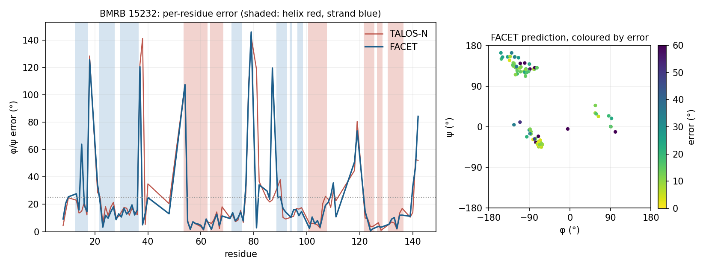

# One protein, end to end

BMRB **15232** — a proline-free mutant of staphylococcal nuclease (SNase V8), 149
residues in the construct, 127 with assigned backbone shifts, 96 with a usable φ/ψ
truth. It is a typical test protein: a mix of helix, strand and coil, median errors
close to the benchmark-wide ones (FACET 12.8°, TALOS-N 14.3° in the record). Everything
below is produced by

```
python benchmarks/walkthrough.py --id 15232
```

## 1. The input

`data/inputs/15232.tab` — the same NMRPipe table TALOS-N received:

```
REMARK Chemical shift table for BMRB entry 15232

DATA FIRST_RESID 1

DATA SEQUENCE ATSTKKLHKE AATLIKAIDG DTVKLMYKGQ AMTFRLLLVD TAETKHTKKG
DATA SEQUENCE VEKYGAEASA FTKKMVENAK KIEVEFDKGQ RTDKYGRGLA YIYADGKMVN
DATA SEQUENCE EALVRQGLAK VAYVYKGNNT HEQLLRKSEA QAKKEKLNIW SEDNADSGQ

VARS   RESID RESNAME ATOMNAME SHIFT
FORMAT %4d   %1s     %4s      %8.3f

   3 S   HN      8.559
   3 S   HA      4.592
   3 S   N     119.090
   3 S   CA     58.094
   3 S   CB     63.978
   4 T   HN      8.348
   ...
```

One line per assigned nucleus. Residue 3 has no C' shift; that is normal and the
model treats it as a masked input.

## 2. Running FACET

```
facet predict benchmarks/data/inputs/15232.tab
```

writes `15232_facet.predtab`:

```
REMARK FACET backbone torsion angle prediction
REMARK facet-nmr 0.4.0 | retrieval index v0.2.1

VARS   RESID RESNAME PHI PSI DPHI DPSI SS CHI1 CLASS
FORMAT %4d %s %8.1f %8.1f %6.1f %6.1f %s %s %s

    3 S   -111.6    141.0   25.0   18.9 C  g- Medium
    4 T   -105.7    142.5   19.3   13.7 C  g+ Medium
    5 K    -79.0    -21.8   17.9   20.1 C  g- Medium
    6 K   -107.6    149.1   23.6   17.8 C  g- Low
    7 L    -87.9    128.5   17.6   22.9 C  g- Medium
```

`DPHI`/`DPSI` are the spread of the retrieved neighbour cluster (1σ, degrees), `CLASS`
is the confidence tier. Residues 3–7 are the disordered N-terminus: the model says so
(coil, Medium/Low, wide error bars), and the structure agrees — they have no φ/ψ truth
and do not appear in the scored table.

## 3. Comparing with the truth and with TALOS-N

The script joins FACET's output with `per_residue.csv`, which carries the structure's
φ/ψ and the TALOS-N prediction for the same residues. A strand, a turn and a helix,
verbatim from the script's output (error = RMS of the wrapped φ and ψ deltas):

```
resid AA  ss   phi_true  psi_true |  phi_facet psi_facet tier      err | phi_talosn psi_talosn class     err
   22 THR   E    -103.5     108.3 |    -118.3     134.2 High       21.1 |    -117.2     141.3 Strong     25.3
   23 VAL   E    -137.9     145.5 |    -133.9     147.9 High        3.3 |    -130.3     141.9 Strong      6.0
   24 LYS   E     -86.9     108.2 |     -99.2     119.8 High       12.0 |    -106.3     125.1 Strong     18.3
   25 LEU   E    -111.5     133.6 |    -101.9     123.4 High        9.9 |     -98.2     123.7 Strong     11.7
   26 MET   E     -81.6     101.3 |     -98.5     112.8 High       14.5 |    -101.1     117.5 Strong     17.9
   27 TYR   E    -104.0     140.1 |    -116.8     117.8 Medium     18.2 |    -129.6     123.9 Strong     21.4
   28 LYS   C      44.2      28.3 |      56.3      30.7 High        8.7 |      54.3      39.2 Strong     10.5
   29 GLY   C      89.0      18.7 |      75.3      14.3 High       10.2 |      77.3       8.7 Strong     10.9
   ...
   36 LEU   E     -57.4     121.0 |     -78.3     129.2 High       15.8 |     -72.8     129.3 Strong     12.3
   37 LEU   C     -77.2     136.0 |     -75.6     -34.4 High      120.5 |    -100.7     -34.9 Warn      122.0
   38 LEU   C      58.2      27.9 |      63.3      23.1 Medium      5.0 |    -114.9     127.5 Warn      141.2
   39 VAL   C    -140.1     149.6 |    -122.0     155.7 High       13.5 |    -133.9     153.7 Strong      5.2
   ...
   56 ALA   H     -67.1     -42.9 |     -66.0     -40.7 High        1.7 |     -65.2     -40.7 Strong      2.0
   57 GLU   H     -68.3     -29.4 |     -69.5     -39.5 High        7.2 |     -67.3     -39.6 Strong      7.2
   58 ALA   H     -59.6     -48.0 |     -62.4     -40.1 High        6.0 |     -63.4     -40.9 Strong      5.7
   59 SER   H     -68.8     -37.1 |     -61.2     -39.1 High        5.5 |     -64.2     -42.1 Strong      4.7
```

What to notice:

* **Residues 28–29 (Lys-Gly, a left-handed turn, φ > 0).** Both methods get it; this
  is the kind of residue a Ramachandran prior alone would miss.
* **Residue 37.** Both methods put it in the helical region; the structure has it
  extended. The error is ~120° for both, and both flag it — FACET's neighbours at
  residue 38 disagree enough that it drops to Medium, TALOS-N says `Warn` for 37–38.
  This is what a large error usually looks like in the benchmark: a single residue in a
  loop, flagged, not a systematic failure.
* **Residue 38.** FACET recovers (5.0°, correctly positive φ); TALOS-N does not (141°).
  One residue, one direction of the head-to-head count.
* **The helix (54–68).** Errors of 2–9° for both. Helix residues are 44 % of the
  benchmark, which is why the all-residue median is dominated by "easy" residues and
  why the coil median (20.9° vs 22.8°) is the more discriminating number.

And one residue to be honest about:

```
   15 ILE   E     -79.2     -55.8 |      -4.8      -4.7 Flexible   63.9 |     -91.0     -38.6 Generous   14.8
```

Residue 15 got no coherent neighbour cluster, so FACET labelled it `Flexible`; the
angle it prints for such residues comes from the parametric head, which collapses
toward (0°, 0°) when retrieval finds nothing and should not be used — which is exactly
what the tier says. TALOS-N
predicted it at 14.8°. The benchmark counts this residue against FACET (it emitted an
angle, so it is in the paired set), and the tier table in `README.md` is where such
residues are accounted for.

## 4. Along the sequence



Left: per-residue error, helix shaded red, strand shaded blue, the 25° fail threshold
dotted. The two traces move together — most of the error is a property of the residue
(loop, turn, or a place where structure and shifts disagree), not of the method — and
FACET sits slightly below TALOS-N on most of the strand and coil stretches. Right:
FACET's prediction on the Ramachandran plane, coloured by error. The ten residues
above 50° are 15, 18, 37, 54, 78, 79, 87, 118, 119 and 142 — every one a coil residue
or a helix/strand boundary, and all but two (37, 54) carry a Medium, Low or Flexible
tier. The point near the origin is residue 15.

## 5. The numbers for this protein

```
this run     : FACET median 13.0°, TALOS-N median 14.3°, FACET lower on 51% of 96 paired residues
record (CSV) : FACET median 12.8° on the same residues; 99% of residues within 0.5° of this run
```

The second line is the reproducibility check: the benchmark of record was produced in
the training harness, this run went through the public `facet.predict()` path, and
95 of 96 residues land within half a degree of each other. The
residue that differs: 15 (7.1° in the record, 63.9° here) —
the public path found no neighbour cluster where the harness found one. Same weights,
same index; the difference is the input path (file parsing, secondary-shift
conversion). This protein has 10 residues without an HA shift; under the 0.3.1 default
they went to the mask-safe fallback and this run reproduced only 94 % of the record —
one of the observations behind making that fallback opt-in (`../docs/BENCHMARKS.md`
§6). `results/talosn_clean/per_residue_rerun.csv` carries this comparison for all 740
proteins and §6 states the overall agreement.
